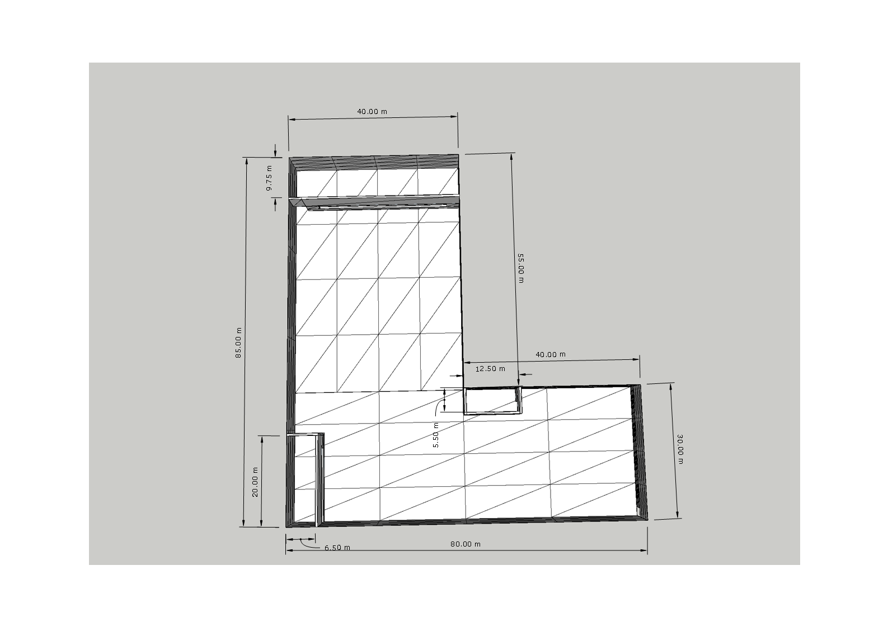
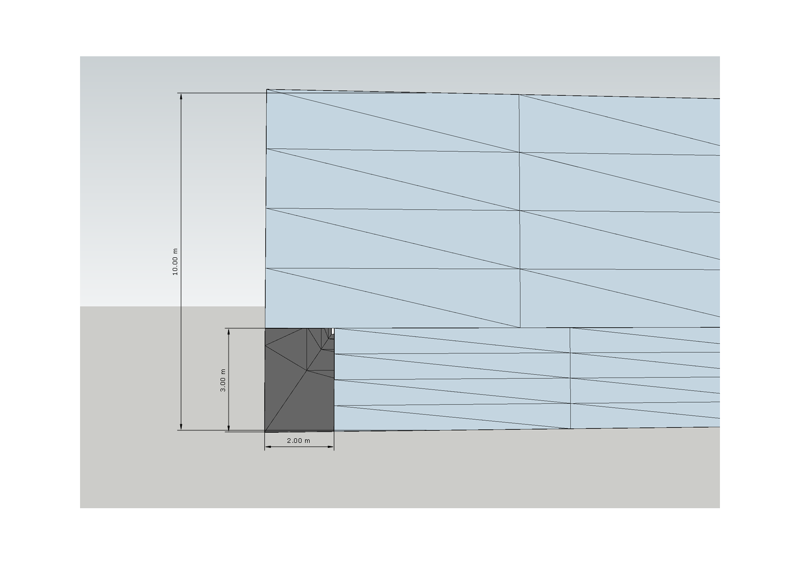
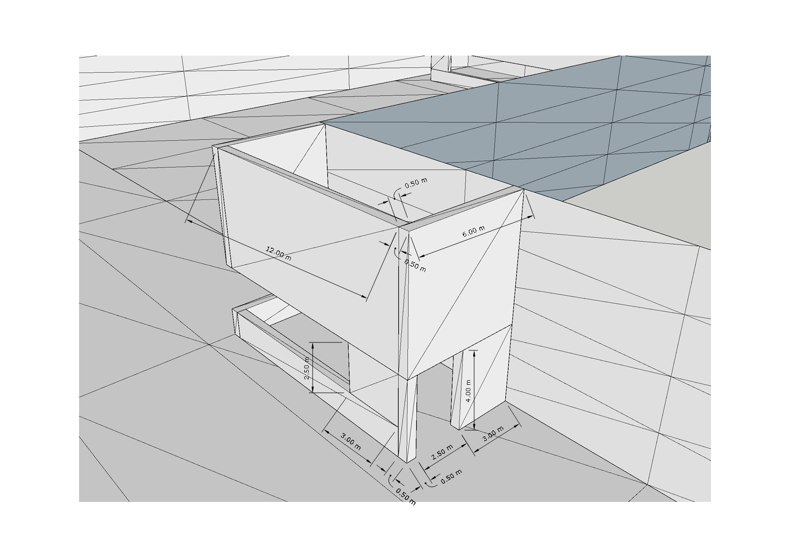
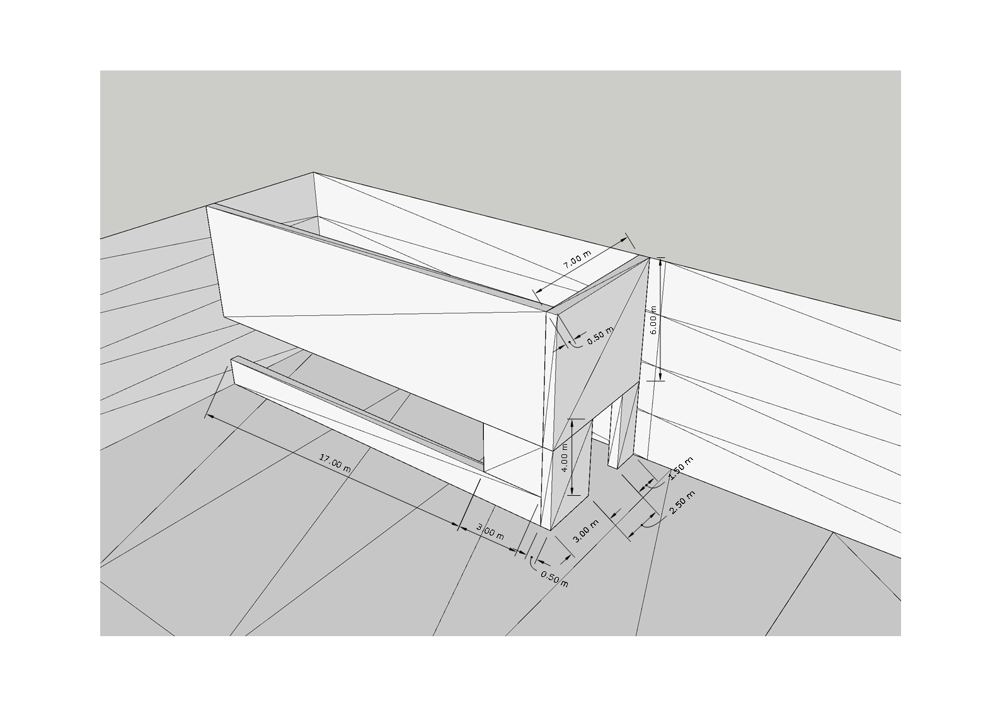
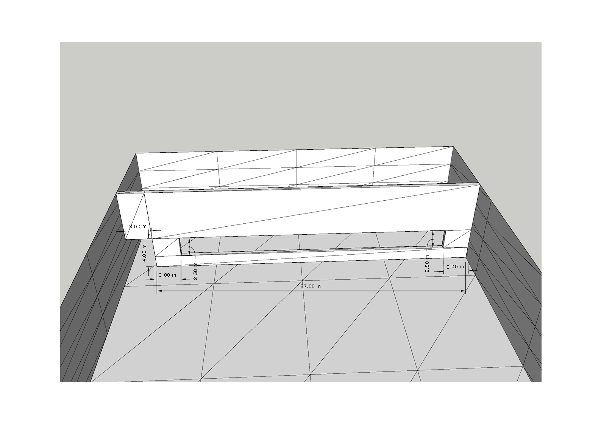
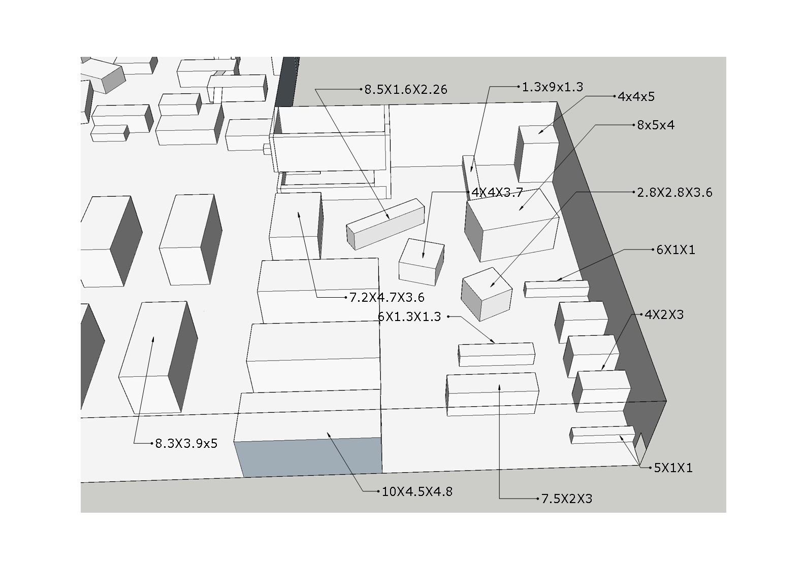
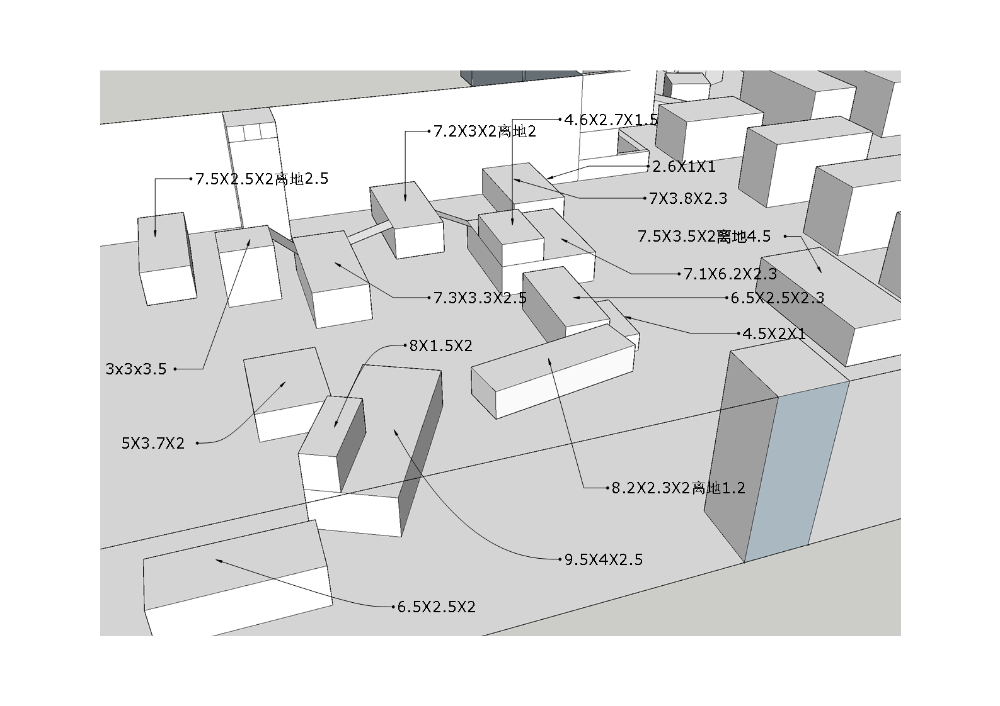

# ROOM1

### 本文档主要对ROOM1中的物体进行详细说明
###### 注：角色跳跃高度为1米多一丢丢，1米高的物体可以跳上去。表格后会附有几张图用以说明。

<table>
    <tr>
        <td align="center"><b>名称</b></td>
        <td align="center"><b>规格（单位米）</b></td>
        <td align="center"><b>所属</b></td>
        <td align="center"><b>备注</b></td>
    </tr>
    <tr>
        <td align="center">房间总览</td>
        <td align="center"></td>
        <td align="center">整个房间的外墙</td>
        <td align="center">具体请看图1及图2</td>
    </tr>
    <tr>
        <td align="center">墙体厚度</td>
        <td align="center">0.5</td>
        <td align="center">房间内各个墙壁的厚度</td>
        <td align="center"></td>
    </tr>
    <tr>
        <td align="center">子房间1具体规格</td>
        <td align="center"></td>
        <td align="center">子房间1</td>
        <td align="center">请看图3</td>
    </tr>
    <tr>
        <td align="center">子房间2具体规格</td>
        <td align="center"></td>
        <td align="center">子房间2</td>
        <td align="center">请看图4</td>
    </tr>
    <tr>
        <td align="center">子房间3具体规格</td>
        <td align="center"></td>
        <td align="center">子房间3</td>
        <td align="center">请看图5</td>
    </tr>
    <tr>
        <td align="center">其他说明</td>
        <td align="center"></td>
        <td align="center">子房间1</td>
        <td align="center">请看图6及图7，具体的规格可以更改，具体的自由发挥也可以。说明：长X宽X高，离地的物体会用离地标识</td>
    </tr>
</table>

- 图1：
    
- 图2：
    
- 图3：
    
- 图4：
    
- 图5：
    
- 图6：
    
- 图7：
    