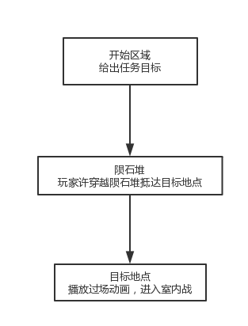

# 太空战
<table>
  <tr>
    <td align="center"><b>版本</b></td>
    <td align="center"><b>更新时间</b></td>
    <td align="center"><b>作者</b></td>
  </tr>
  <tr>
    <td align="center"><b>0.1</b></td>
    <td align="center"><b>2018.06.07</b></td>
    <td align="center"><b>禤劲涛</b></td>
  </tr>
</table>

- 太空战大致地图：未完成
- 描述：太空战中只包含了一个关卡
- 任务目标：穿越陨石堆、抵达目标地点
- 具体流程：
    1. 玩家给定任务目标，离开母舰
    2. 玩家遭遇陨石堆，需要穿过陨石堆才能抵达目标地点
    