# 室内战

<table>
  <tr>
    <td align="center"><b>版本</b></td>
    <td align="center"><b>时间</b></td>
    <td align="center"><b>作者</b></td>
  </tr>
  <tr>
    <td align="center"><b>0.1</b></td>
    <td align="center"><b>2018.06.07</b></td>
    <td align="center"><b>禤劲涛</b></td>
  </tr>
  <tr>
    <td align="center"><b>0.2.1</b></td>
    <td align="center"><b>2018.06.09</b></td>
    <td align="center"><b>禤劲涛</b></td>
  </tr>
  <tr>
    <td align="center"><b>0.2.2</b></td>
    <td align="center"><b>2018.06.11</b></td>
    <td align="center"><b>禤劲涛</b></td>
  </tr>
    <tr>
    <td align="center"><b>0.2.3</b></td>
    <td align="center"><b>2018.06.12</b></td>
    <td align="center"><b>禤劲涛</b></td>
  </tr>
  <tr>
    <td align="center"><b>0.2.4</b></td>
    <td align="center"><b>2018.06.13</b></td>
    <td align="center"><b>禤劲涛</b></td>
  </tr>
  <tr>
    <td align="center"><b>0.2.5</b></td>
    <td align="center"><b>2018.06.26</b></td>
    <td align="center"><b>禤劲涛</b></td>
  </tr>
</table>

- 室内战大致地图（待更新）
    - 图中只包含了基本流程，其他分支无包含。
    - 若想查看分支2，请点击[室内战地图V1](../../images/planning/室内战V1.png)
    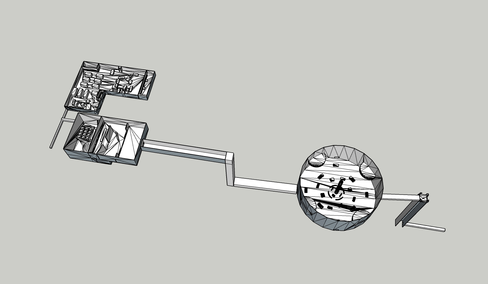

- 游戏具体流程
    - 图中的实线为基本流程，虚线为分支1，点虚线为分支2
    - 分支1：若开发时间不够，可选择性地进行该分支
    - 分支2：若开发时间有余，建议由该分支进行开发
    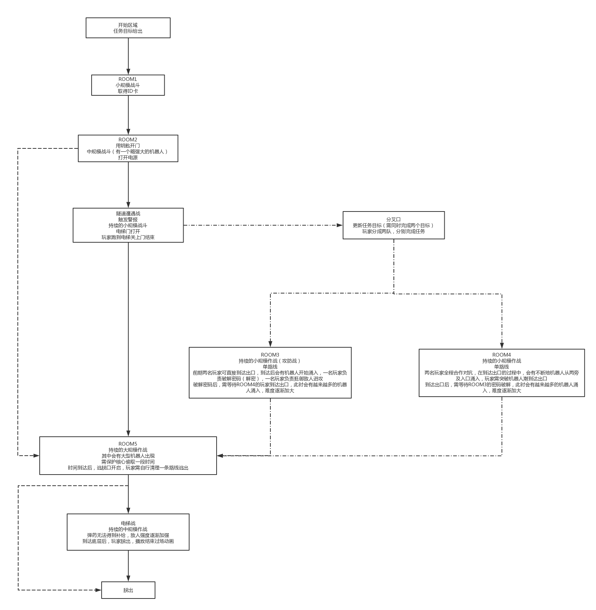

- 关卡
    - 注：所有的持续战斗的难度会逐渐加大。
    ---
    - ROOM1（拟为小仓库）
        - 描述：玩家在该房间中会遭遇小规模的战斗，敌人防守强度不大，但进攻强度会稍微提高。
        - 任务目标：找出ID卡、逃离房间
        - 房间流程：
            1. 房间内会有防守机器人，进入后会启动预设机器人，玩家需要尽可能击毁机器人。
            2. 房间共有3个ID卡地点，玩家需要每个地点都走一遍，找出可用的ID卡。在第三个ID位置前会有一个必需要拿的物体，玩家需先过去get到才能开门。
            3. 任务目标显示为SubROOM1，玩家需前往寻找钥匙。
            4. 过了SubROOM1后，任务目标更新为SubROOM2，玩家需前往寻找钥匙。
            5. 两个SubROOM都过了之后，任务目标更新为SubROOM3前的必需品。
            6. 取得必需品，任务目标更新为开门。进入SubROOM3后取得OK的ID卡。
            7. 取得OK的ID卡后，房间的警报会响起，同时会涌入较多的机器人，玩家需清理出一条道路逃离房间。
        - 地图：
            - 俯视图：
                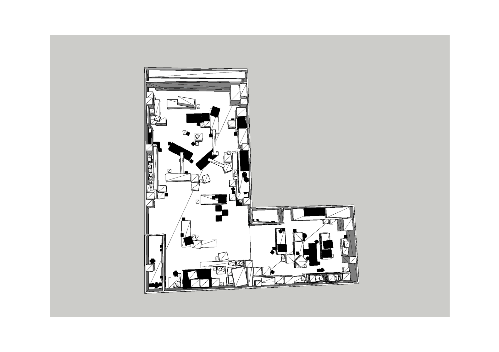
            - 透视图：
                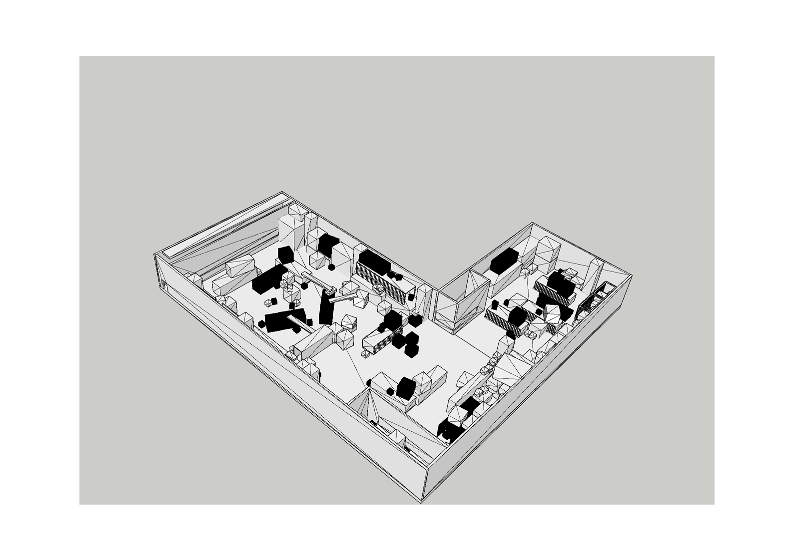

    ---
    - ROOM2（拟为电源室）
        - 描述：玩家在该房间会遭遇中规模战斗，敌人防守强度适中，会有一个大型机器人保护电源开关。
        - 任务目标：打开电源、逃离房间
        - 房间流程：
            1. 开始时，房间没有灯光，需要打开透视仪进行游戏。
			2. 房间分为两层，会有较多的防守机器人，玩家需尽可能击毁机器人。
            3. 在一楼遭遇机器人群，并打开电源开关。
            4. 打开电源后，警报再度响起，玩家需跑上二楼。
            5. 在二楼，此时会有较多机器人出没，并且还有大型机器人存在，玩家需要击毁大型机器人逃离房间。与此同时，一楼的机器人会慢慢上楼，这时需要一个玩家卡住楼梯。
            5. 击毁大型机器人后，门打开，玩家迅速跑去门口离开。
        - 地图：
            - F1俯视图：
                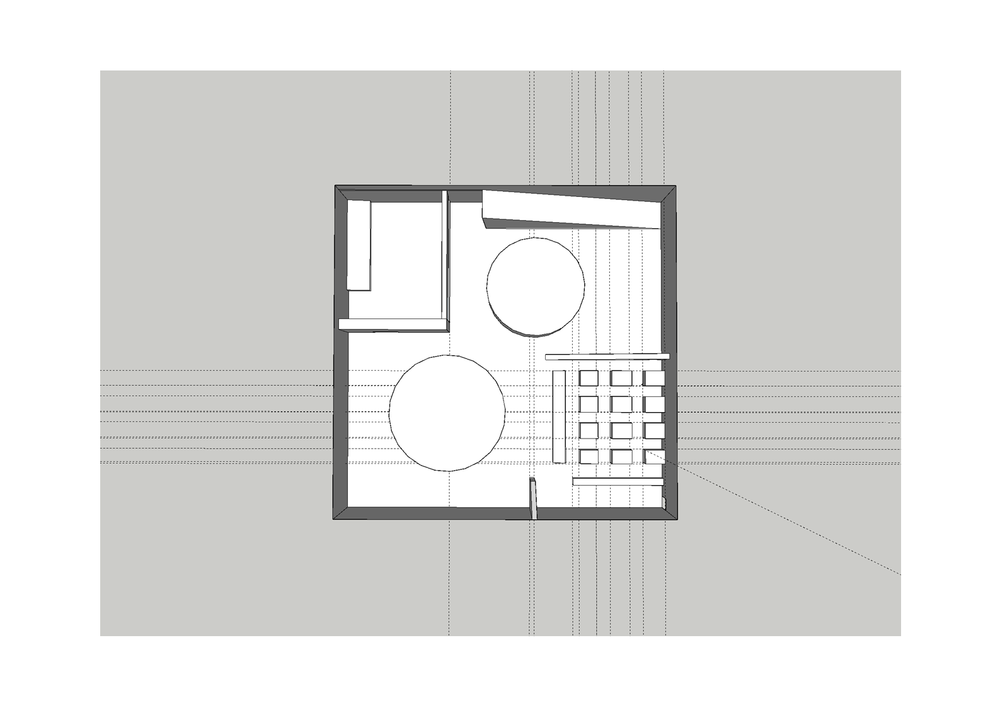
            - F1透视图：
                
            - F2俯视图：
                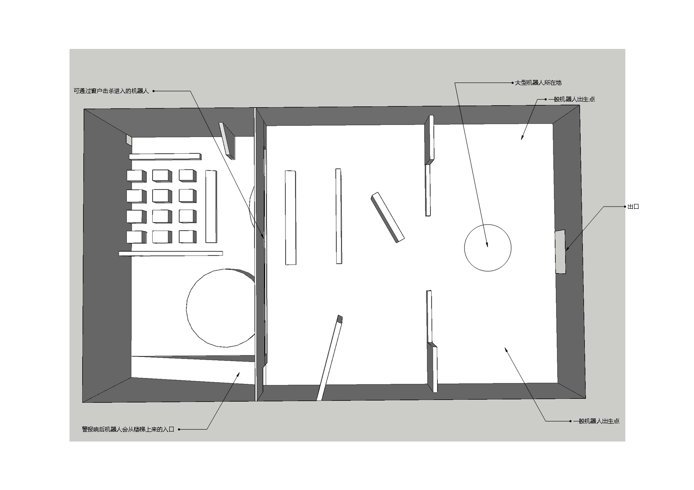
            - F2透视图：
                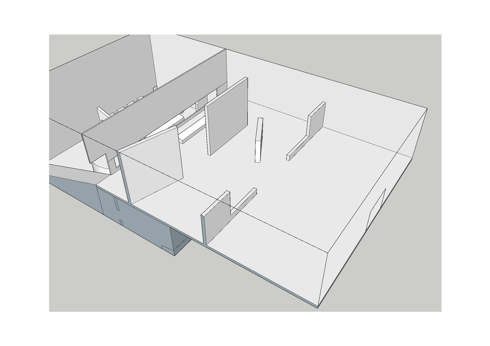
    ---
    - ROOM5 （鲲的核心战）
        - 描述：玩家在该房间中，须取得核心，
        - 任务目标：取得核心、保护分离核心过程、逃离房间
        - ROOM5流程：
            1. 进入房间，无预设机器人，玩家可直接到达核心处启动核心。
            2. 启动核心后，警报响起，炮台被激活，大约有3波机器人从各方向涌入，其中第二波会出现1个大型机器人，第三波会出现2个大型机器人，玩家需抵御机器人进攻一段时间。
            3. 核心启动完，警报提醒将启动自毁程序，此时会仍有一小撮机器人涌入，并且会打开一扇门，玩家需穿过机器人堆到达门口处，然后进行电梯战。
        - 地图：
            - 俯视图
                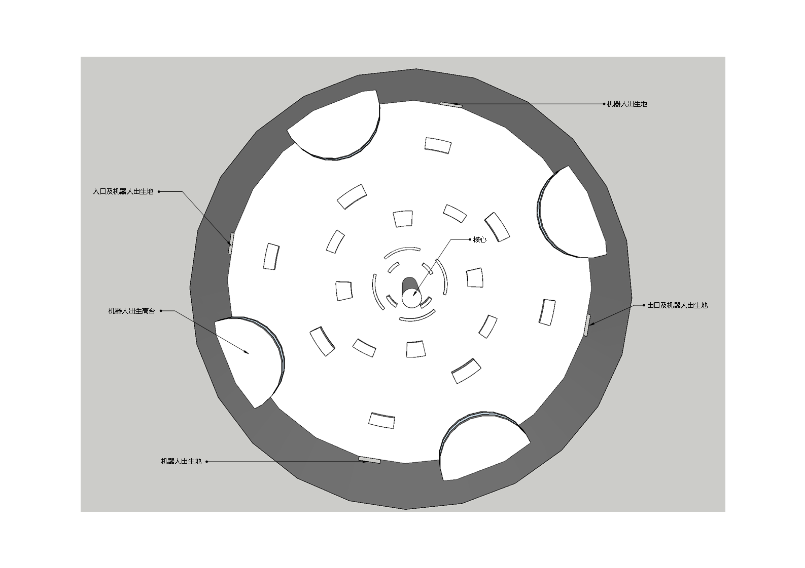
            - 透视图
                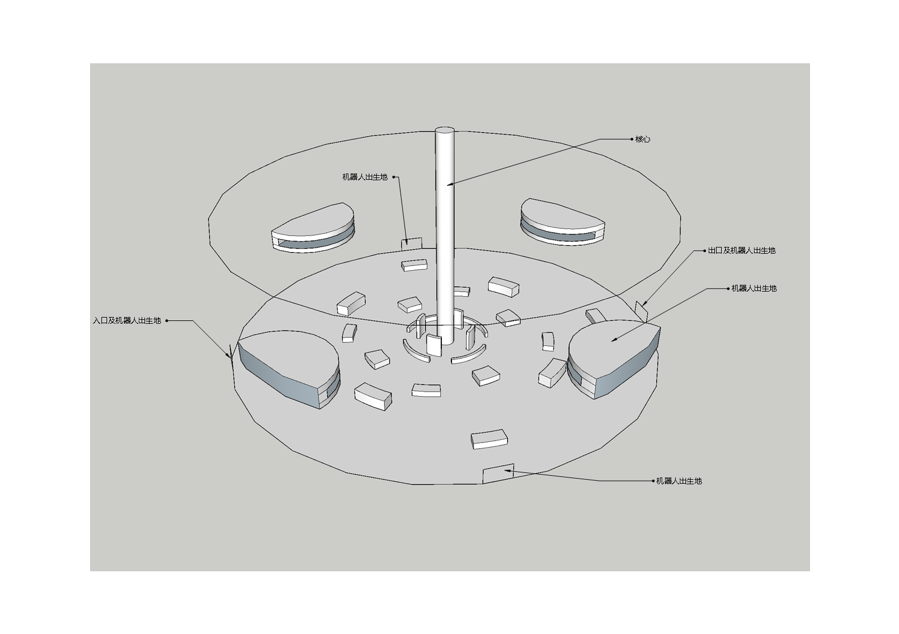
    ---
    - 电梯战
        - 描述：玩家在电梯中，需抵御源源不断的机器人进攻，并活下去。
        - 任务目标：抵御机器人进攻
        - 电梯战流程：
            1. 进入电梯，玩家需打开电梯下降开关。
            2. 电梯下降过程中，有不断的机器人涌出（从上面或者下面），此时玩家要抵御机器人狂潮。
            3. 一段时间后，爆炸引起，电梯到达底部，玩家需要在限定时间中，抵达出口。
        - 地图：
            - 由于电梯战是想弄一个类似于困兽斗之类的，故里面没有什么复杂的掩体
            - 俯视图
                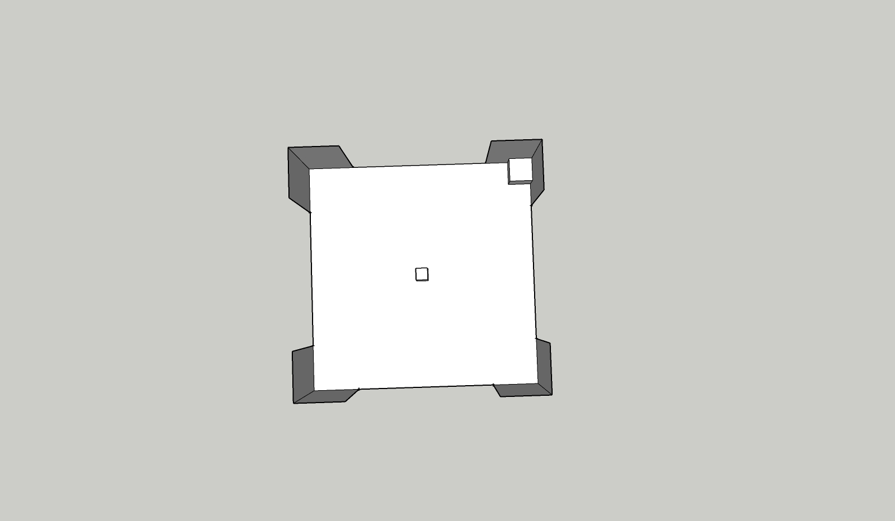
            - 透视图
                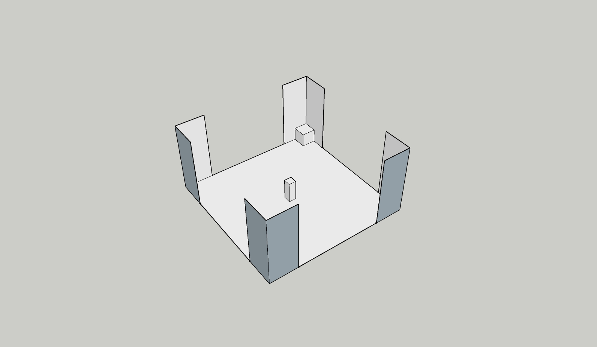
    ---
    - 隧道遭遇战（未确定）
        - 描述：玩家在隧道中会遭遇持续不断的小规模的机器人袭击，而玩家需要尽快到达电梯口。
        - 任务目标：抵御敌人进攻、到达电梯口
        - 遭遇战流程：
            1. 玩家进入隧道，警报响起，隧道两旁会有源源不断的机器人冒泡。
            2. 在前段时间，玩家需要抵挡住来自前方机器人的攻击，善用掩体。
            3. 过了隧道一半后，机器人会从入口进入，并追击玩家。
            4. 整个过程中，若玩家长时间没有抵达电梯口，会出现大型机器人。
            5. 抵达后，玩家进入电梯，前往下一关卡
        - 地图：未完成
    ---
    - ROOM3（未确定）
        - 描述：玩家需要破解开门谜题，并抵御敌人进攻
        - 任务目标：破解谜题、开启出口
        - ROOM3流程：
            1. 玩家进入房间后，无预设机器人，玩家可直接冲到破解迷题的地点。
            2. 开始破解迷题后，警报响起，机器人开始涌入，但需要一只玩家破解迷题，另一只玩家抵御敌人进攻。
            3. 破解谜题后，需等待ROOM4的玩家抵达终点，大门方可开启，此时，会有持续不断的机器人涌入，两只玩家需要支持住。
        - 地图：未完成
    ---
    - ROOM4（未确定）
        - 描述：玩家需要穿过机器人群，并在不断地机器人潮中活下去，抵达大门。
        - 任务目标：抵达大门
        - ROOM4流程：
            1. 玩家进入房间后，会有较多的机器人，玩家需突破机器人的防御，抵达大门处。
            2. 抵达大门后，若ROOM3的密码破解尚未完成，玩家会受到持续不断的机器人的进攻，只有等到ROOM3的密码破解后，大门才能开启。
        - 地图：未完成

- 优先度：
    1. ROOM5、ROOM2、ROOM1
    2. 电梯战、隧道战
    3. ROOM3、ROOM4

- 补充说明：
    - ROOM3与ROOM4会作为一个补充要素吧，可能加上就时间不太够，若时间还是不够就也要把隧道战砍了。