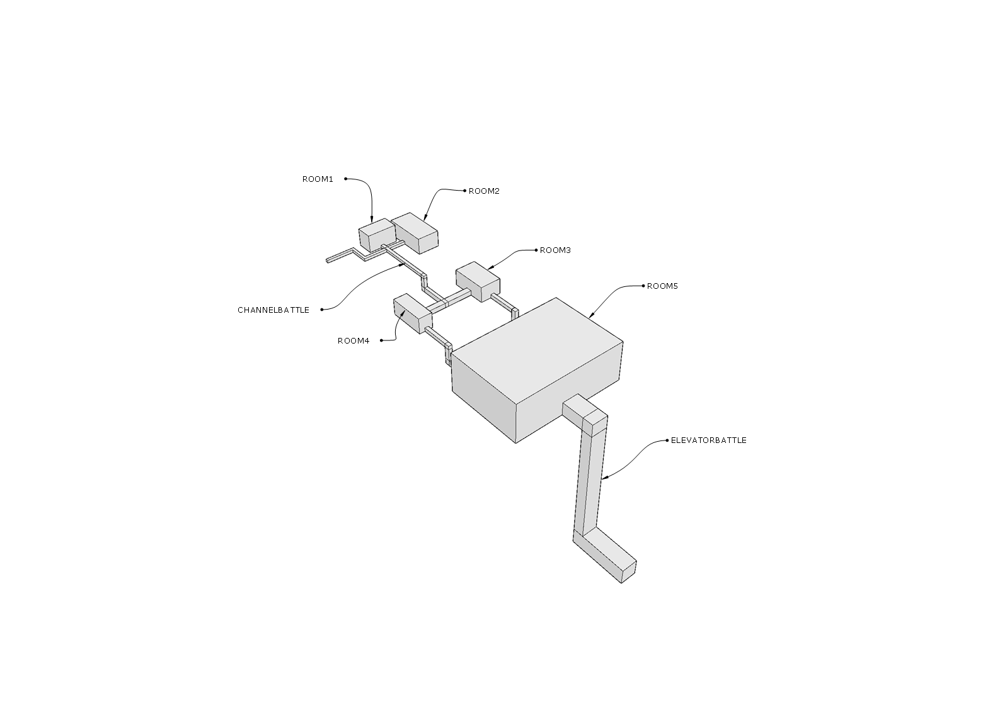
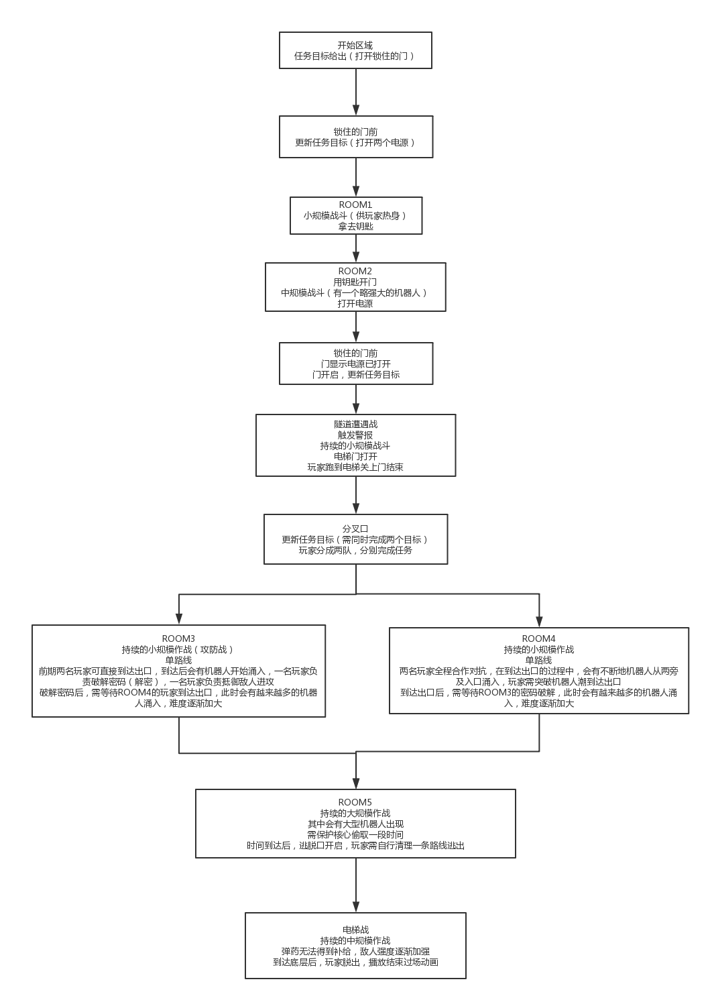

# 室内战

<table>
  <tr>
    <td align="center"><b>版本</b></td>
    <td align="center"><b>更新时间</b></td>
    <td align="center"><b>作者</b></td>
  </tr>
  <tr>
    <td align="center"><b>0.1</b></td>
    <td align="center"><b>2018.06.07</b></td>
    <td align="center"><b>禤劲涛</b></td>
  </tr>
</table>

- 室内战大致地图
    

- 游戏具体流程
    

- 关卡
    - 另：所有的持续战斗的难度会逐渐加大。
    - ROOM1（拟为小仓库）
        - 描述：玩家在该房间中会遭遇小规模的战斗，敌人防守强度不大，但进攻强度会稍微提高。
        - 任务目标：取得钥匙、逃离房间
        - 房间流程：
            1. 房间内会有防守机器人，进入后会启动预设机器人，玩家需要尽可能击毁机器人。
            2. 取得钥匙后，房间的警报会响起，同时会涌入较多的机器人，玩家需清理出一条道路逃离房间。
        - 地图：
            - 俯视图：
                
            - 透视图：
                
    - ROOM2（拟为电源室）
        -描述：玩家在该房间会遭遇中规模战斗，敌人防守强度适中，会有一个大型机器人保护电源开关。
        - 任务目标：打开电源、逃离房间
        - 房间流程：
            1. 房间较大，会有较多的防守机器人，道路比较崎岖，玩家需极可能击毁机器人。
            2. 在电源开关前遭遇大型机器人，玩家需要击败或用一些骚操作来搞定大型机器人，然后打开电源。
            3. 打开电源后，警报再度响起，玩家需对抗机器人浪潮，并逃离房间。
        - 地图：未完成
    - ROOM3（未确定）
    - ROOM4（未确定）
    - ROOM5 （鲲的核心战）
    -