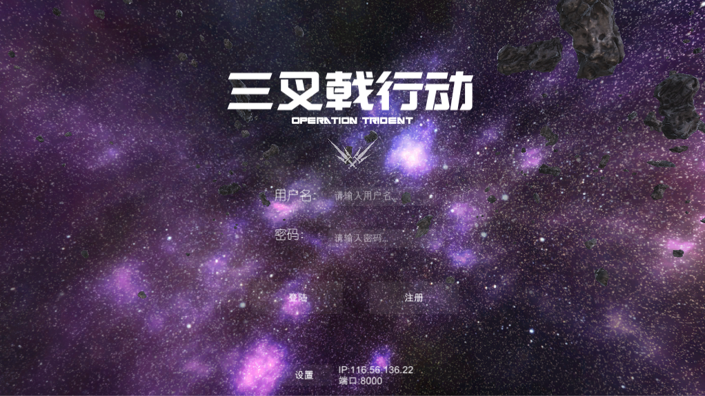
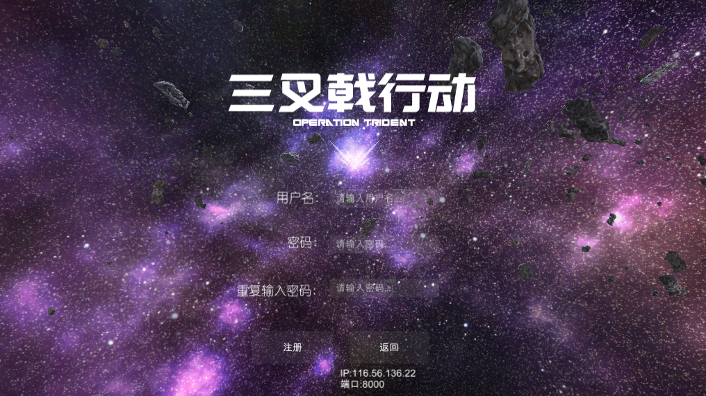
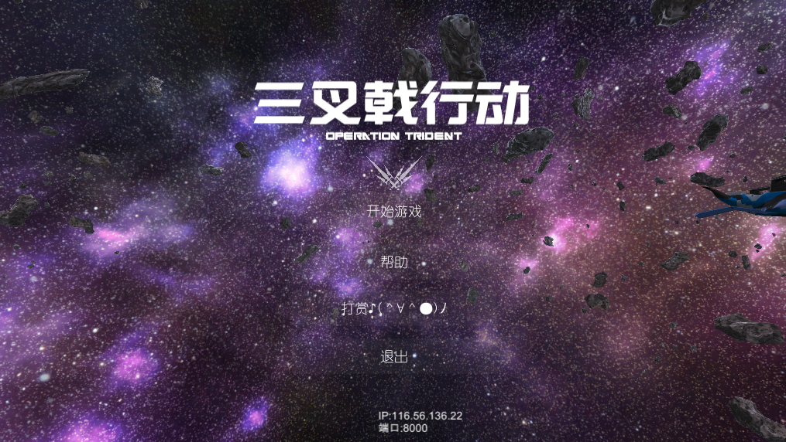
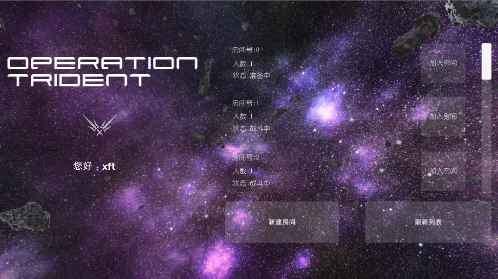
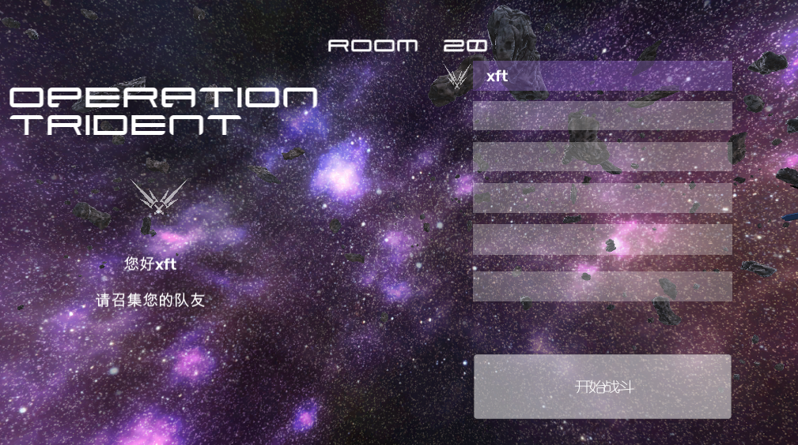
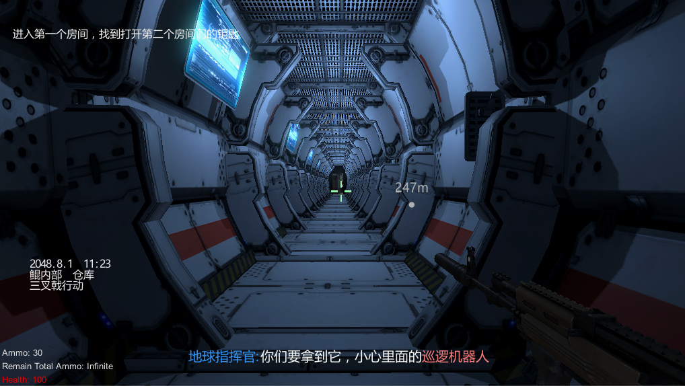

# 游戏策划

<table>
  <tr>
    <td align="center"><b>版本</b></td>
    <td align="center"><b>时间</b></td>
    <td align="center"><b>作者</b></td>
  </tr>
  <tr>
    <td align="center"><b>0.1</b></td>
    <td align="center"><b>2018.06.06</b></td>
    <td align="center"><b>禤劲涛</b></td>
  </tr>
  <tr>
    <td align="center"><b>0.2</b></td>
    <td align="center"><b>2018.06.11</b></td>
    <td align="center"><b>禤劲涛</b></td>
  </tr>
  <tr>
    <td align="center"><b>0.3</b></td>
    <td align="center"><b>2018.06.28</b></td>
    <td align="center"><b>禤劲涛</b></td>
  </tr>
  <tr>
    <td align="center"><b>0.4</b></td>
    <td align="center"><b>2018.06.29</b></td>
    <td align="center"><b>禤劲涛</b></td>
  </tr>
</table>

- 概述
  - 游戏名称：三叉戟行动
  - 介绍：这是一款多人PVE的FPS游戏，一共由四名玩家参与游戏。在游戏的过程中，四名玩家需操作对应的角色以完成不同的任务目标。角色会主要运用枪械或使用手雷击毁敌人。游戏的创新性主要体现在整个游戏融合了多种游戏玩法，并且玩家能在一款游戏中体验到不同的乐趣。同时，为了让玩家有一个良好的体验，游戏时长大概为20~30分钟及难度会保持在一个恰当的范围。
  - 类型：FPS（主要）
  - 游戏风格：赛博朋克、近未来
  - 使用平台：运行系统：WIN10
  - 目标用户：偏向于乐于寻找刺激体验的各年龄范围的游戏玩家
  - 文档目的：对整个游戏进行概要描述，详细内容均在对应的文档中体现。

- 游戏结构
  - 核心游戏玩法：在游戏中,指挥官（NPC）会给玩家发送任务目标，而玩家要根据指挥官发送的任务目标进行游戏。游戏中的目标包含有取得指定物品，攻防战，逃脱等（逃脱视开发进度而定）。每个玩家均有武器~~及手雷~~，用以辅助游戏进行。~~并且每个玩家可以有供自己补血的物品。~~
  
  - 游戏剧情：详情请看[剧情文档](2018.06.12剧情策划(v1.0).pdf)

  - 游戏方式：游戏方式可根据场景分为两种。玩家在每个关卡或场景中需完成指定的目标才能继续进行后续剧情。
    - 太空战：玩家需通过WSDA及鼠标来控制角色穿越障碍物。
    - 室内战：玩家需通过WSDA来移动，并控制鼠标来改变转向。同时，玩家可通过点击对应的按键射击敌人及发射导弹。

  - 游戏流程：
    - 开始游戏阶段：进入游戏首先会弹出一个登陆界面，登录后会进入一个等待界面。四名玩家均到齐后，游戏开始。
    - 游戏开始后，会先播放几个背景视频。
    - 游戏进行阶段：游戏的整个过程可以分为两大关卡：太空战与室内战。
      - 太空战：四名玩家在太空战中需躲避迎面而来的障碍物。一段时间后，若无玩家阵亡，则通过。详情可于[太空战文档](太空战.md)中了解。
      - 室内战：四名玩家需完成数个任务目标。玩家共需要完成四个场景内的战斗。详情可于[室内战文档](室内战.md)中了解。
    - 室内战结束后，会播放结束动画及制作人员名单。
  - 游戏模式：游戏模式为四人在线FPS游戏。
  - 提示：~~在新的任务目标，装备消耗不足，生命值不足及走在不能前进的道路上时提醒玩家。~~ 对玩家进行任务目标的提示。

  - 游戏要素：详细信息可在[要素设计文档](要素设计.md)中了解，每个关卡切换都会有过场动画。
    - 玩家：共四名玩家，每位玩家都有不同的武器。
    - 敌人：
      - 机器人：分两种机器人：一般机器人及巨型机器人。
      - 固定炮台：炮台固定在某个地方，会对进入一定范围的玩家进行射击。
    - 技能系统：该系统为额外要素，视开发进度而定。
	- 武器系统：该部分为描述玩家用到的武器等。
    - 其余要素

  - AI功能：游戏AI包括一般机器人AI，ROOM2大型机器人AI，ROOM5大型机器人AI及炮台AI.
    - 一般机器人：一般机器人能在固定的路线上行走，会自行寻路，同时会对遇见的玩家进行射击。
    - ROOM2大型机器人：该机器人为特化模式的机器人，该机器人会根据血量来变更不同的攻击模式。它含有的攻击模式有
      - 机枪扫射 ~~（血量百分之70以上）~~ ：1. 机器人会举起它的手沿着某个方向像机关枪一样持续发射子弹。2. 机器人会对某个固定地点进行疯狂攻击。
      - 导弹 ~~（血量百分之50以上）~~ ：机器人会对玩家所在位置延迟发射导弹，导弹会造成范围伤害。
      - ~~导弹天上来（血量百分之25以上）：机器人会挥一挥手，然后会有导弹爆炸范围提醒玩家，一段时间后，会产生爆炸。~~
      - ~~生气气跺脚（血量百分之10以上）：机器人会如同生气气般跺起脚，会造成范围眩晕。~~
      - ~~狂暴模式（血量百分之0以上）：机器人会强化各种攻击模式，如双枪老太婆，疯狂导弹射击，跺跺跺脚等。~~
    - ~~ROOM5大型机器人：主要逻辑与一般机器人一样，但会附加某些ROOM2大型机器人的功能。~~
    - 固定炮台：炮台会在固定的朝向自动探测玩家，然后会自行攻击玩家，嘟嘟嘟。

- 玩家界面
  - 游戏界面
    - 游戏中会标记任务目标。

    - 游戏登录界面：
      
      玩家在该界面中需输入用户名及密码用以登录游戏。

    - 游戏注册界面：
      
      玩家需输入用户名及密码和确认密码用以注册账号。

    - 游戏主菜单：
      
      主菜单的功能如图所示。

    - 游戏选择房间界面如下：
      
      界面左边显示游戏名称及玩家昵称，右边则列出所有的房间，玩家可选择新建界面、加入战斗或刷新列表。

    - 房间的准备界面如下：
      
      界面左边显示游戏的相关信息，右边则显示房间内的玩家及是否开始战斗（只有房主能操作）。

    - 太空战的游戏界面如下：
      
      人物居于画面中央
      画面左上角显示当前任务目标，左下角显示当前血量，及中下方显示字幕。

    - 室内战的游戏界面如下：
      
      画面左上方显示当前任务目标，左中显示整个三叉戟行动的一些信息，左下显示当前血量及弹药数，中下方则显示字幕。

- 多媒体素材
  - 美术
    整体风格为科幻风，关于具体角色等的美术资源，请看[要素设计文档](要素设计.md)。
  - 音乐音效
    - 风格：主题风格为动作片原声类型，即紧张，刺激等。
    - 音效：游戏中出现的音效主要为玩家和AI的动作所发出的一系列声音。