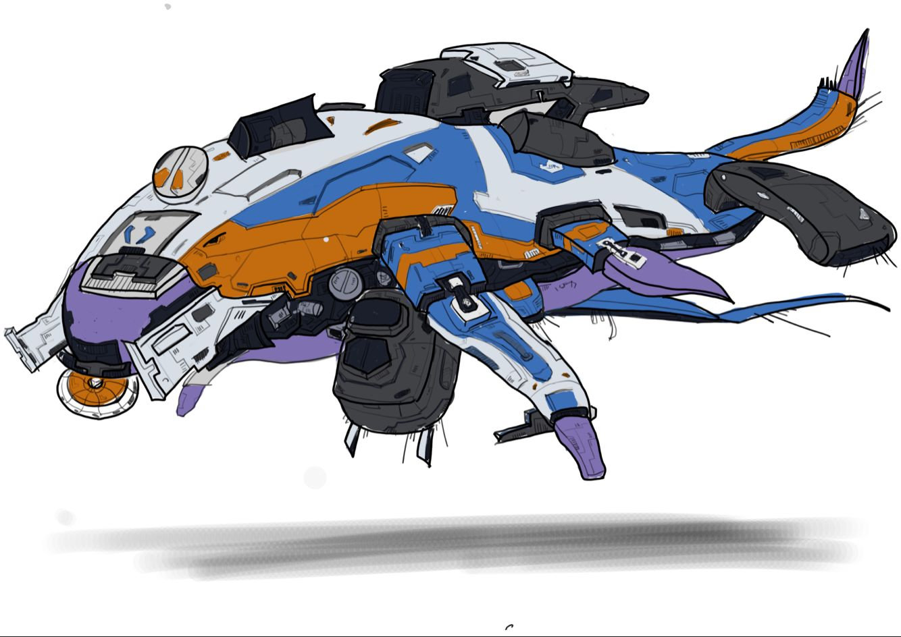

# 要素设计

<table>
  <tr>
    <td align="center"><b>版本</b></td>
    <td align="center"><b>时间</b></td>
    <td align="center"><b>作者</b></td>
  </tr>
  <tr>
    <td align="center"><b>0.1</b></td>
    <td align="center"><b>2018.06.09</b></td>
    <td align="center"><b>禤劲涛</b></td>
  </tr>
</table>

- 文档说明：该文档主要说明游戏内会出现的角色，及它们所用到的武器或技能等的设计。

- 游戏要素概要描述：
  - 概述：主要描述游戏中可能会出现的能与显示在屏幕中的物体s。其包括：
    1. 鲲
    2. 太空母舰
    3. 主角s
    4. 四人舰
    5. 机器人s
    6. 炮台
    7. 武器
    8. 其他要素
  - 鲲：鲲为战斗的剧情的主要推动要素，但不会经常出现在屏幕中。主要存在位置为：过场动画、宣传片或CG，太空战中的主要目标地点。鲲主要设计思想是半机械半生物的构思，其中它的体内为战斗的主要发生地点。下图为大致的鲲的样子（由美工组设计），
    
  - 太空母舰：母舰的作用也是与鲲类似。主要存在的位置为：母舰为开始时可能需要其内部的场景、游戏开始时的主要出发地点、过场动画、宣传片或CG。太空母舰的图尚未找到。
  - 主角s：主角为玩家所操控的人物，其主要为玩家用于与游戏场景或游戏进行交互的媒介。主角为覆盖于碳纤维下的人类，并且能用枪械或其他物品攻击敌人，能进行一些基本的动作，如跳跃，奔跑。下图为大致的主角的样子（美工组），
    
  - 四人舰：四人舰为主角用以逃离鲲体内所乘坐的载具。其主要构思为一艘能承载四人的小舰。下图为大致的四人舰的样子（美工组），
    
  - 机器人s：机器人主要为与玩家敌对的角色，即为敌对势力的玩家s。它主要分为两种：一般机器人与大型机器人。
  - 炮台：炮台主要是为预设布置的用于偷袭玩家的机械构件，能自动射击玩家的固定在某个地点的物体。
  - 武器：武器主要为
  - 其他要素：其他要素为在游戏中重要度不太高的物体，主要责任为与玩家进行某些操作，如ID卡，门及控制台等物体。

- 主要要素的详细描述：
  - 概述：这里主要是对一些主要要素进行较为细致的描述
  - 