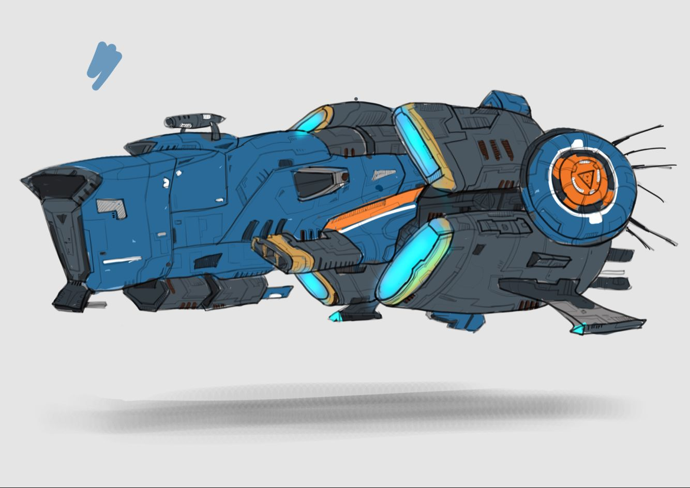
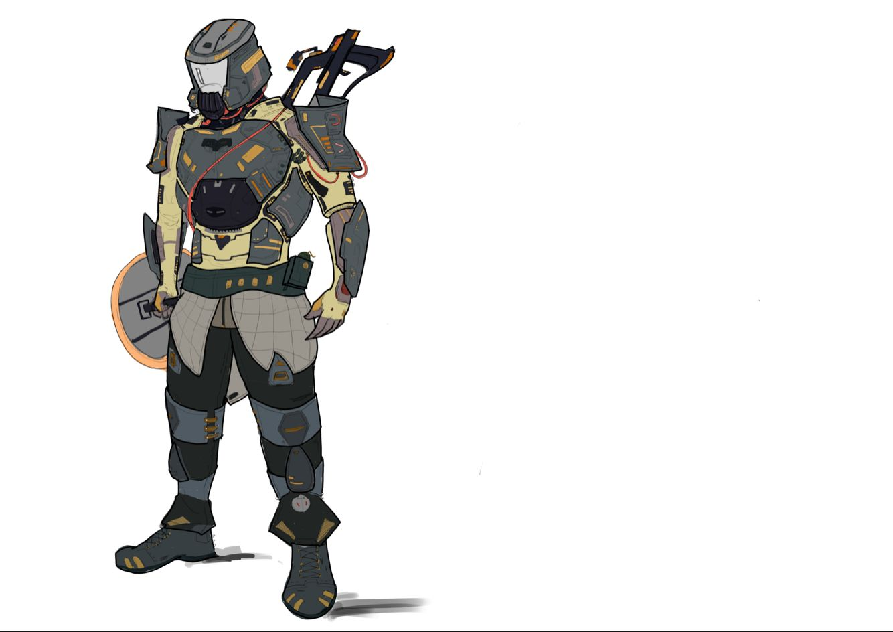

# 要素设计

<table>
  <tr>
    <td align="center"><b>版本</b></td>
    <td align="center"><b>时间</b></td>
    <td align="center"><b>作者</b></td>
  </tr>
  <tr>
    <td align="center"><b>0.1</b></td>
    <td align="center"><b>2018.06.09</b></td>
    <td align="center"><b>禤劲涛</b></td>
  </tr>
    <tr>
    <td align="center"><b>0.2</b></td>
    <td align="center"><b>2018.06.11</b></td>
    <td align="center"><b>禤劲涛</b></td>
  </tr>
</table>

- 文档说明：该文档主要说明游戏内会出现的角色，及它们所用到的武器或技能等的设计。

- 游戏要素概要描述
  - 概述：主要描述游戏中可能会出现的能与显示在屏幕中的物体s。其包括：
    1. 鲲
    2. 太空母舰
    3. 主角s
    4. 四人舰
    5. 机器人s
    6. 炮台
    7. 武器
    8. 其他要素
  - 鲲：鲲为战斗的剧情的主要推动要素，但不会经常出现在屏幕中。主要存在位置为：过场动画、宣传片或CG，太空战中的主要目标地点。鲲主要设计思想是半机械半生物的构思，其中它的体内为战斗的主要发生地点。下图为大致的鲲的样子（由美工组设计），
    

  - 太空母舰：母舰的作用也是与鲲类似。主要存在的位置为：母舰为开始时可能需要其内部的场景、游戏开始时的主要出发地点、过场动画、宣传片或CG。太空母舰的图尚未找到。下图为大致的太空母舰的样子（美工组），
    

  - 主角s：主角为玩家所操控的人物，其主要为玩家用于与游戏场景或游戏进行交互的媒介。主角为覆盖于碳纤维下的人类，并且能用枪械或其他物品攻击敌人，能进行一些基本的动作，如跳跃，奔跑。下图为大致的主角的样子（美工组），
    

  - 四人舰：四人舰为主角用以逃离鲲体内所乘坐的载具。其主要构思为一艘能承载四人的小舰。

  - 机器人s与炮台：机器人主要为与玩家敌对的角色，即为敌对势力的玩家s。它主要分为两种：一般机器人与大型机器人。炮台主要是为预设布置的用于偷袭玩家的机械构件，能自动射击玩家的固定在某个地点的物体。机器人s及炮台的大概样子（美工组）如下，
    

  - 武器：武器主要为用于玩家操作开火攻击敌人的物体。

  - 其他要素：其他要素为在游戏中重要度不太高的物体，主要责任为与玩家进行某些操作，如ID卡，门及控制台等物体。

- 主要要素的详细描述
  - 概述：这里主要是对一些主要要素进行较为细致的描述，如一些具有的属性和元素等。

  - 主角s：主角s的基本属性主要为生命值，主角的生命值不能通过呼吸来回血，需用到一些物品或通过关卡来进行补充。主角s会有一个通用的技能或道具供他们自己进行回血，该技能或道具会有使用限制，只有通过进行补给才能回复使用次数。同时，主角s都配置有枪及手雷，EMP（若无技能），枪主要为对机器人造成持续的伤害，而手雷在投掷后碰地数秒后会炸裂造成巨额的伤害，EMP则能使一定范围内的机器人或炮台瘫痪一段时间。另，主角s能与某些具体场景的物体进行交互。主角s还有隐藏的仇恨值，用来表示机器人会对哪个玩家进行攻击。

  - 武器：武器会有后坐力系统，持续开火的时候，准星会逐渐扩大，并且能进行开镜瞄准。开镜后的准星为一个点，持续开枪的时候镜头会跳动，准星会持续往上飘。

  - 一般机器人：一般机器人为群居生物，一出来就是一堆，他们会自主地攻击主角s，而是攻击的精准度不高，伤害适中。主要存在于地图各处。若有EMP，可通过EMP造成短暂的昏厥。

  - 大型机器人：目前的构思是，巨大的庞然大物，攻击方式为近战或远程攻击（看开发进度），移动较为缓慢，护甲（生命值）较高，难以打死，但输出高。若有EMP，可通过EMP造成短暂的昏阙。

  - 炮台：为固定于场景中某些位置的物体，当玩家进入其视线范围内，它会自行攻击玩家或需要被启动后才能攻击玩家。若有EMP，可通过EMP使其瘫痪一段时间。

- 额外要素
  - 概述：该部分为描述游戏内可实现的要素，即不硬性要求实现的要素。

  - 技能：每个角色都有不同的技能，技能的主要功能是为了辅助玩家游戏，并且玩家的输出主要模式还是用武器biubiubiu，而技能目的只是为了辅助。目前我的构思是：EMP（小型的，只能对某一小范围的机器人作用，使其停止机能。），探索（这个技能可以探照一定范围的场景，扫描出陷阱及机器人分布或者在解密内有很大作用），炮台（玩家会设置一个自动攻击炮台，与敌对的炮台一个样，会自动攻击机器人并吸引仇恨）及治疗（恢复技能的上位替代，因为我的构思是四名角色中有一个医疗兵，用来恢复生命值的，可以对队友或自己进行治疗或提供短暂的护盾效果）。

  - ROOM3及ROOM4（这个会在具体的[室内战文档](室内战.md)中体现）