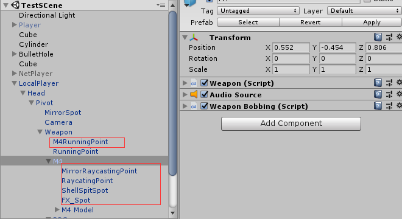

# 使用Weapon模块快速创建枪械

| 编写日期   | 作者    |
| ---------- | ------- |
| 2018.06.30 | AsanCai |

## Weapon模块功能说明
不同的角色可能需要不同的枪械，使用已有的Weapon模块可以通过设置参数快速创建不同的枪械进行使用

***

## 创建武器
### Weapon脚本的设置
1. 创建一个Empty GameObject，将其命名为新武器的名字，如`M4`
2. 添加脚本Weapon.cs，存放目录为`..\Assets\Common\FPS\Scripts`（会自动添加脚本WeaponBobbing.cs和组件AudioSource）
3. 将枪械模型`Weapon Model`设置为GameObject `M4`的子对象，并重置其`Transform`组件（点击`Transform`右上方的`齿轮图标`，然后点击`Reset`）
4. 根据需要调整`Weapon Model`的大小，也就是设置其`Transform`组件的`Scale`
5. 设置`Weapon`脚本的参数，`Weapon`脚本会根据已有的选择动态改变需要设置的参数，因此按照`Inspector`面板显示的内容设置好参数即可
6. `Weapon`脚本已经设置好所有参数的说明，将`鼠标悬停在相应的参数上面`即可看到对应的说明
7. 特殊说明：对于所有`Transform类参数`，用于设置的对象都必须设置为`M4`的子对象，以获取正确的相对位置

### WeaponBobbing脚本的设置
1. 跟`Weapon`脚本一样，`WeaponBobbing`脚本已经设置好所有参数的说明，可以直接在`Inspector`面板查看提示
2. 特殊说明：用于设置`RunningPosition`参数的对象应该和`M4`同级，否则无法获取正确的相对位置信息

### 结构示例

***