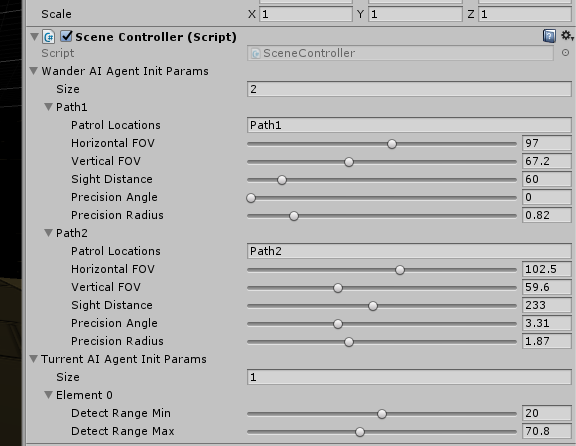
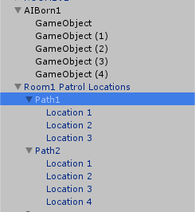

# 创建AI

| 编写日期   | 作者   |
| ---------- | ------ |
| 2018.06.30 | 邓隽元 |
| 2018.07.09 | 王泽众 |

## 功能

在指定地点创建指定数量的AI，使用该接口创建出来的AI会自动同步并确保在所有客户端的位置、转向和AI状态机保持一致。


## 使用方式

### 每个场景添加AIController.prefab

使用AIContoller.prefab，拖动到场景中，每个场景需要设置自己的AI Prefabs（AI种类）


### 函数调用

```c#
    /// <summary> 
    /// 在所有客户端，在名字为swopPoints的节点的子节点创建num个类型为type的AI，该事件会自动RPC同步，无需在调用的时候使用RPC来调用
    /// </summary> 
    /// <param name="num">创建的AI数量，应与swopPoints的节点的子节点数量一一对应</param> 
    /// <param name="type">AI Prefabs中的种类，索引从0开始</param>  
    /// <param name="swopPoints">场景中AI的生成点的节点名字，其子节点数量应与num对应</param>     
    /// <param name="args">AI的参数，num个AI的参数相同</param>     
    /// <returns></returns> 
    public void CreateAI(int num, int type, string swopPoints, AIAgentInitParams args)
```

### 使用示例

一般各个场景会有个SceneController(根据自己脚本实现，无需完全相同）, 来控制场景，可以在SceneController中调用CreateAI来创建AI，然后在SceneController中需要设置你需要创建的AI种类对应的参数。

```

    public class SceneController : MonoBehaviour
    {
        [SerializeField]
        WanderAIAgentInitParams[] wanderAIAgentInitParams;
        [SerializeField]
        TurretAIAgentInitParams[] turrentAIAgentInitParams;

        // Use this for initialization
        void Start()
        {
            AIController.instance.CreateAI(7, 0, "AIBorn0", wanderAIAgentInitParams[0]);   
            AIController.instance.CreateAI(8, 0, "AIBorn0", wanderAIAgentInitParams[1]);
            AIController.instance.CreateAI(5, 1, "AIBorn1", turrentAIAgentInitParams[0]);
        }

        // Update is called once per frame
        void Update()
        {

        }
    }
```

### 参数设置
SceneController设置参数界面



参数解释：


    public class TurretAIAgentInitParams : AIAgentInitParams
    {
        [Tooltip("设置检测范围最小半径")]
        [Range(10, 30)]
        public float detectRangeMin;

        [Tooltip("设置检测范围最大半径")]
        [Range(50, 100)]
        public float detectRangeMax;
    }

    public class WanderAIAgentInitParams : AIAgentInitParams
    {
        [Tooltip("设置巡逻路径，传入一个根节点")]
        public string patrolLocations = null;

        [Tooltip("设置水平FOV角度")]
        [Range(0, 180)]
        public float horizontalFOV = 120f;

        [Tooltip("设置垂直FOV角度")]
        [Range(0, 180)]
        public float verticalFOV = 60f;

        [Tooltip("设置视线距离")]
        [Range(0, 500)]
        public float sightDistance = 100f;

        [Tooltip("设置射击精度范围角度")]
        [Range(0, 10)]
        public float precisionAngle = 5f;

        [Tooltip("设置射击精度范围半径")]
        [Range(0, 5)]
        public float precisionRadius = 1f;
    }


### 场景设置AI生成点，WanderAIAgent巡回点

注意：
- AISwopPoints节点下至少有一个子节点，一次性生成2个AI时，会自动将2个AI位置对应至AISwopPoints中的swop1和swop2，而不是在相同位置生成（避免卡住）
- WanderAIAgent的patrolLocations输入的是所要巡回路径的根节点，也就是Path1下对应应该有多个点，然后AI会获得节点并在这些节点中巡回。
- 场景需要NavMesh Surface烘焙





