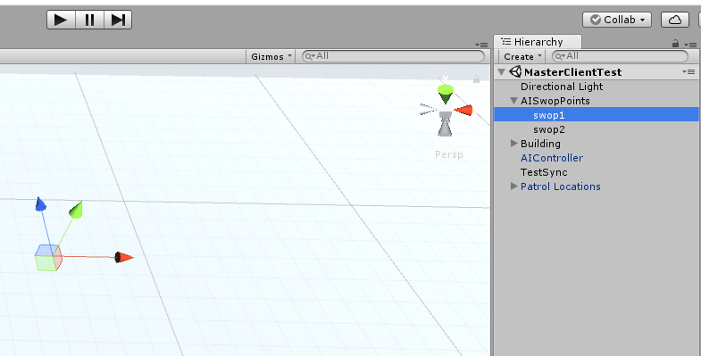

# 创建AI

| 编写日期   | 作者   |
| ---------- | ------ |
| 2018.06.30 | 邓隽元 |

## 功能

在指定地点创建指定数量的AI，使用该接口创建出来的AI会自动同步并确保在所有客户端的位置、转向和AI状态机保持一致。


## 使用方式

### 每个场景添加AIController.prefab

使用AIContoller.prefab，拖动到场景中，每个场景需要设置自己的AI Prefabs（AI种类）


### 函数调用

```c#
    /// <summary> 
    /// 在所有客户端，在名字为swopPoints的节点的子节点创建num个类型为type的AI，该事件会自动RPC同步，无需在调用的时候使用RPC来调用
    /// </summary> 
    /// <param name="num">创建的AI数量，应与swopPoints的节点的子节点数量一一对应</param> 
    /// <param name="type">AI Prefabs中的种类，索引从0开始</param>  
    /// <param name="swopPoints">场景中AI的生成点的节点名字，其子节点数量应与num对应</param>         
    /// <returns></returns> 
    public void createAI(int num, int type, string swopPoints)
```

### 使用示例

按空格键在AISwopPoints中创建一个AI

```
    void Update()
    {
        if (Input.GetKeyDown(KeyCode.Space))
        {
            try
            {
                AIController.instance.createAI(1, 0, "AISwopPoints");
            }
            catch (NullReferenceException ex)
            {
                Debug.Log("Exception:" + ex);
            }
        }
    }
```

### 场景设置AI生成点

注意，AISwopPoints节点下至少有一个子节点，一次性生成2个AI时，会自动将2个AI位置对应至AISwopPoints中的swop1和swop2，而不是在相同位置生成（避免卡住）




