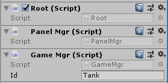
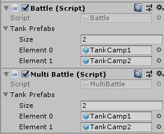
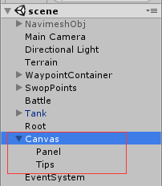
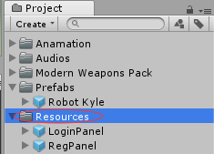

# 客户端框架
## 场景布置
场景中需要一个Root节点，挂载三个脚本组件  


还需要一个Battle节点，挂载Battle 或 MultiBattle脚本组件，其中Battle组件用于单机游戏，没有网络同步函数，其负责生成玩家角色、判定胜负等，而Multi Battle组件在Battle组件的基础上扩充了网络模块。



## MultiBattle脚本
在MuliBattle脚本中的StartBattle函数中注册和监听战场同步的事件和协议，
```c#
//开始战斗
public void StartBattle(ProtocolBytes proto)
{
    //解析协议
    int start = 0;
    string protoName = proto.GetString(start, ref start);
    if (protoName != "Fight")
        return;
    ……
    ……
    NetMgr.srvConn.msgDist.AddListener ("UpdateUnitInfo", RecvUpdateUnitInfo);
    NetMgr.srvConn.msgDist.AddListener ("Shooting", RecvShooting);
    NetMgr.srvConn.msgDist.AddListener ("Hit", RecvHit);
    NetMgr.srvConn.msgDist.AddListener ("Result", RecvResult);
}
```
例如UpdateUnitInfo、Shooting、Hit、Result等事件。

例如当监听到UpdateUnitInfo事件，调用RecvUpdateUnitInfo函数，在该函数中调用坦克更新其数据（例如生命值、位置、状态）。

故要同步某个物体的事件，需要在MultiBattle.cs中维护一个它们的列表，并在StartBattle函数中注册一个新的协议和事件，并在事件回调函数中解析协议的值用以更新需同步物体的信息。

## 协议
### 客户端解析协议

在前面的StartBattle函数中注册不同的回调函数用于解析不同的协议。
例如RecvUpdateUnitInfo回调函数解析”UpdateUnitInfo”协议，参考解析代码如下：

```c#
public void RecvUpdateUnitInfo(ProtocolBase protocol)
{
    //解析协议
    int start = 0;
    ProtocolBytes proto = (ProtocolBytes)protocol;
    string protoName = proto.GetString(start, ref start);
    string id = proto.GetString(start, ref start);
    Vector3 nPos;
    Vector3 nRot;
    nPos.x = proto.GetFloat(start, ref start);
    nPos.y = proto.GetFloat(start, ref start);
    nPos.z = proto.GetFloat(start, ref start);
    nRot.x = proto.GetFloat(start, ref start);
    nRot.y = proto.GetFloat(start, ref start);
    nRot.z = proto.GetFloat(start, ref start);
    float turretY = proto.GetFloat(start, ref start);
    float gunX = proto.GetFloat(start, ref start);
    //处理，将解析出来的信息（借id）应用到坦克列表中指定的坦克
    ……
}
```

在这里更新其他玩家（不经玩家输入）的信息，

```c#
players[id].controller.UpdateUnitInfo(pos,score,m_move,m_jump,crouch);
```


### 客户端发送协议

需要同步玩家操纵角色的信息，在玩家控制器中的PlayerCtrl函数中同步需要同步的信息，实现 “谁需要同步自身的信息，就去谁自身的控制器脚本那里发送”。

```c#
//玩家控制
public void PlayerCtrl()
{
    //接受玩家输入并改变坦克的状态
    //网络同步
    if (Time.time - lastSendInfoTime > 0.2f)
    {
        SendUnitInfo();
        lastSendInfoTime = Time.time;
    }
}
```

在SendUnitInfo()中，将自身的信息封装成协议发送给服务器
```c#
public void SendUnitInfo()
{
    ProtocolBytes proto = new ProtocolBytes();
    proto.AddString("UpdateUnitInfo");
    //位置旋转
    Vector3 pos = transform.position;
    Vector3 rot = transform.eulerAngles;
    proto.AddFloat(pos.x);
    proto.AddFloat(pos.y);
    proto.AddFloat(pos.z);
    proto.AddFloat(rot.x);
    proto.AddFloat(rot.y);
    proto.AddFloat(rot.z);
    //炮塔
    float angleY = turretRotTarget;
    proto.AddFloat(angleY);
    //炮管
    float angleX = turretRollTarget;
    proto.AddFloat(angleX);
    NetMgr.srvConn.Send(proto);
}
```


## 玩家控制器框架

在玩家角色的控制器脚本中，定义控制类型CtrlType枚举类型：

```c#
    public enum CtrlType
    {
        none, //例如该角色已经死亡，不接受键盘输入和网络同步
        player, //接受玩家的输入
        computer, //采用AI，具体参考AI模块
        net, //该角色是其他玩家，需要网络同步
    }
```


在FixedUpdate()中，不同类型的CtrlType接受不同的更新：

```C#
private void FixedUpdate()
{
        //网络同步
        if (ctrlType == CtrlType.net)
        {
            NetUpdate();
            return;
        }
        //操控
        PlayerCtrl();
}
```

其中，PlayerCtrl()处理玩家的输入，NetUpdate()将网络更新的值应用


### NetUpdate()和UpdateUnitInfo()

UpdateUnitInfo()由Net Manager.cs（例如 MultiBattle.cs）调用，其频率取决于其他玩家的输入频率

NetUpdate()是由网络更新的玩家的FixedUpdate()函数调用，其作用为应用UpdateUnitInfo()所带来的影响


## 界面的框架

在场景放置画布Canvas(包含Panel 和Tips 两个空物体)



同时还需要Event System、Root节点，并在Root节点中挂载Panel Mgr脚本组件。

注意，将界面保存成prefabs后需要放置到Resources文件夹里面才能由PanelMgr进行读取和载入。




