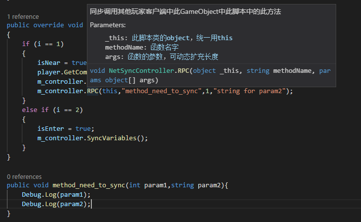

# 通用网络组件和接口使用

## Prefabs介绍

目前有两个Prefabs：NetWorkManager.prefab、EnterNextScene.prefab，

### NetWorkManager.prefab

其中NetWorkManager.prefab中包含了SwopPoints节点，其中的四个节点代表了四个玩家的出生点。而NetWorkManager.cs组件中的Player Prefabs数组存放了四个玩家不同的角色（目前都是Player.prefab）的prefab。


### EnterNextScene.prefab

EnterNextScene.prefab是一个一定透明的立方体，包含了Box Collider组件和EnterNextScene.cs脚本组件，EnterNextScene.cs的NextScene指定了下一个场景的名字，当四个玩家均到达EnterNextScene.prefabs里面之后即可实现场景跳转。

注意预先在Build Setting中添加进要跳转的场景。


## 组件介绍

NetSyncTransform目前仅用于四个玩家角色的位置、转向同步（可勾选预测同步），将其挂载在Player.prefab中。

NetSyncController挂载在需要同步状态或同步函数调用的GameObject上，其用于同步GameObject的状态和挂载在GameObject上的脚本变量（例如场景状态、人物生命值）或函数调用。

与NetSyncController一同挂载的脚本需要同步变量的话需要继承NetSyncInterface。


## 状态同步使用示例

### 为需要同步状态的物体添加NetSyncController.cs脚本组件

以欧哥的Room2Battle为例，其场景状态是由场景的一个节点Room2SubSceneController来控制的，为了让其他玩家也同步场景状态，为Room2SubSceneController挂载NetSyncController.cs。


### 为需要同步变量和函数的脚本继承接口

若想要同步Room2_enter(Script)组件的信息到其他玩家的Room2SubSceneController节点的Room2_enter(Script)组件中，则需要把Room2_enter(Script)拖到NetSyncController的Sync_scripts中，并同时使得Room2_enter.cs继承接口：NetSyncInterface。同时要多声明一个成员变量NetSyncController m_controller。


继承接口后需要实现三个方法：


其中Init方法的实现都是一样的。（由于C#不能多继承，考虑到我们内部也有其他基类例如SubScene，故暂时不能用基类的方式实现基类的Init方法和基类成员m_controller）


而SendData与RecvData方法需要按指定顺序一一对应地将所有要同步的变量添加进SyncData。

### 调用同步函数

在room2_enter.cs中，客户端逻辑中发现isNear变化了，于是在改变后马上调用同步函数：

```
m_controller.SyncVariables();
```

例如：

```
        public override void notify(int i)
        {
            if (i == 1)
            {
                isNear = true;
                player.GetComponent<becomeDark>().enabled = true;
                m_controller.SyncVariables();
            }
            else if (i == 2)
            {
                isEnter = true;
                m_controller.SyncVariables();
            }
        }
```

注意，每次同步会将之前添加进SendData和RecvData函数中的所有变量进行同步。

同时，应当注意同步函数的调用频率，频率越高意味着对服务器压力越大。


## 函数调用同步使用示例

继承NetSyncInterface之后，只要初始化好NetSyncController m_controller即可使用RPC，SendData和RecvData函数与RPC调用无关（甚至可以不实现）

### 调用RPC函数

```c#
public void RPC(object _this, string methodName, params object[] args)
```

使用示例：在某玩家的场景状态切换完之后，调用method_need_to_sync函数，其他玩家就会调用此函数。




## 状态同步、函数调用同步会作用到自己吗？

不会。玩家1要求进行同步，该同步信息不会作用到自身，虽然服务器会将玩家1的信息发到房间内的所有玩家（包括玩家1），但组件NetSyncController、NetSyncTransform都会丢弃自己发出去又发回给自己的信息

## 特别提示=-=
强调一下，RPC对于一些函数（每个玩家都会执行一次的）不能正确应用，例如OnTriggerExit或OnTriggerEnter等等一些函数，RPC如果在这些函数被调用的话，会出现特别奇怪的问题，如跳过判断等等。


