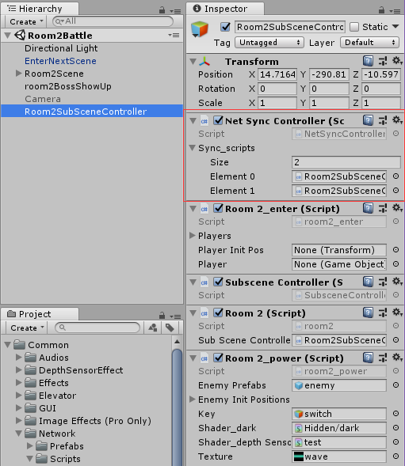

# 通用网络组件和接口使用

## 组件介绍

其中NetSyncController为需要挂载的组件，而NetSyncInterface为通用接口。


## 使用示例

### 为需要同步的物体添加NetSyncController.cs脚本组件

以Standard Asset的ThirdPersonCharacter为例，使得Standard Asset中的ThirdPersonController预制体能够同步位置、转向和动画。



将NetSyncController.cs拖动到ThirdPersonController预制体的Inspector面板中，


### 拖动需要更新的脚本至NetSyncController组件中

然后将ThirdPersonController预制体的Inspector中的Third Person User Control(Script)脚本拖动到刚刚添加的NetSyncController脚本组件中的Sync_Scripts中（可以动态扩充脚本）：


拖进去的任何脚本都需要实现接口：NetSyncInterface

### 分析需要同步的数据

为了同步骨骼动画，分析ThirdPersonUserControl.cs，

在Update()中，根据CrossPlatformInputManager.GetAxis("...")和Input.GetKey(KeyCode.XXX)来改变m_Move、crouch、m_Jump这些变量，并传入到m_Character中调用Move函数，产生细腻的骨骼动画。

```
        // read inputs
        float h = CrossPlatformInputManager.GetAxis("Horizontal");
        float v = CrossPlatformInputManager.GetAxis("Vertical");
        crouch = Input.GetKey(KeyCode.C);

        // calculate move direction to pass to character
        if (m_Cam != null)
        {
            // calculate camera relative direction to move:
            m_CamForward = Vector3.Scale(m_Cam.forward, new Vector3(1, 0, 1)).normalized;
            m_Move = v * m_CamForward + h * m_Cam.right;
        }
        else
        {
            // we use world-relative directions in the case of no main camera
            m_Move = v * Vector3.forward + h * Vector3.right;
        }
#if !MOBILE_INPUT
        // walk speed multiplier
        if (Input.GetKey(KeyCode.LeftShift)) m_Move *= 0.5f;
#endif

        // pass all parameters to the character control script
        m_Character.Move(m_Move, crouch, m_Jump);
        m_Jump = false;
```

故获取用户的输入最终产生以下几个结果来驱动动画，我们就同步这些变量。

```
Vector3 m_Move; //计算出来的move direction
bool crouch; //是否蹲下
bool m_Jump; //是否跳跃
```


### 实现通用接口

例如ThirdPersonUserControl.cs，使其实现NetSyncInterface接口：


使用了NetSyncInterface接口的类需要实现一下两个函数，注意SetData、GetData中数据是按顺序传入和传出的。

```
    /// <summary> 
    /// 网络同步传入数据，改变该脚本组件状态        
    /// </summary> 
    /// <param name="data">传入的数据</param>         
    /// <returns></returns> 
    public void SetData(SyncData data)
    {
        crouch = (bool)(data.Get(typeof(bool)));
        m_Jump = (bool)(data.Get(typeof(bool)));
        m_Move = (Vector3)(data.Get(typeof(Vector3)));
    }
    
    /// <summary> 
    /// 获取该脚本组件的状态，自动同步到其他客户端中有着该对象名字的gameObject中        
    /// </summary> 
    /// <param></param>         
    /// <returns type="SyncData">返回打包好的数据</returns> 
    public SyncData GetData()
    {
        //消息
        SyncData data = new SyncData();
        data.Add(crouch);
        data.Add(m_Jump);
        data.Add(m_Move);
        return data;
    }
```

这样便实现了骨骼动画的同步。